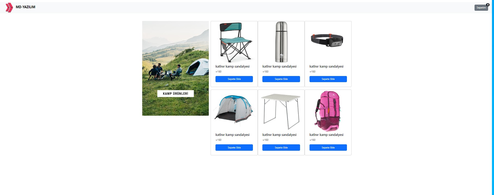

# Bootstrap Web Project

This project is a simple web application built using Bootstrap 5.3.2. It showcases a web page with a navigation bar, product cards, and a shopping cart feature.

## Table of Contents

- [Description](#description)
- [Screenshot](#screenshot)
- [Technologies Used](#technologies-used)
- [How to Use](#how-to-use)
- [Contributing](#contributing)
- [License](#license)

## Description

The project consists of a simple web page with the following components:

- Navigation bar with a logo and a shopping cart icon.
- Product cards displaying various camping gear items with images, titles, prices, and "Add to Cart" buttons.
- Shopping cart badge displaying the number of items in the cart.

## Screenshot

## Live Demo

Check out the live demo [here](https://bootstrap2-beta.vercel.app/).

## Technologies Used

- HTML5
- CSS3
- Bootstrap 5.3.2

## How to Use

1. Clone this repository to your local machine.
2. Open the `index.html` file in your web browser.
3. Browse through the products and click "Add to Cart" to add items to your cart.

## Contributing

Contributions to this project are welcome! If you'd like to enhance the project or fix any issues, feel free to fork the repository and submit a pull request.

## License

This project is licensed under the [MIT License](LICENSE).

